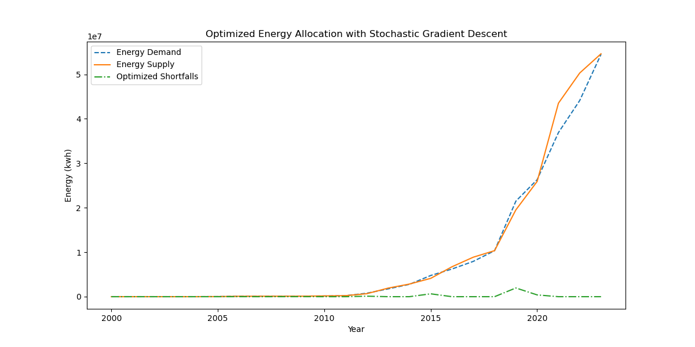
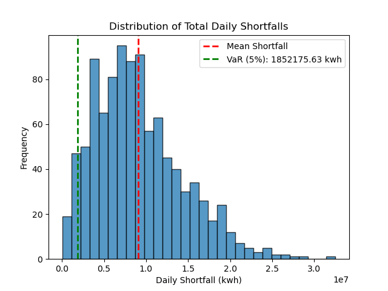

# Energy Demand and Supply Optimization in Renewable Systems 

## About 
This project is a Python-based energy optimization tool designed to balance energy demand and supply in renewable systems, such as solar and wind power. It uses data from Our World in Data, Ember, and the Energy Institute to simulate demand, optimize energy storage, and minimize shortfalls. 

--- 
## Features 
- Key Optimization Components: 
    - Stochastic Gradient Descent (SGD) with Momentum for minimizing energy shortfalls 
    - Monte Carlo simulations to assess variability and risk 
- Outputs: 
    - Optimized energy storage allocation 
    - Mean energy shortfall 
    - 95% confidence interval for shortfalls 
    - Value at Risk (5%) 
    - Visualizations of demand vs. supply and shortfall distributions 
---
## How It Works 
1. Data Preparation: 
- The program uses solar and wind power generation data from the dataset. Since the dataset does not have any demand data, we generated simulated demand with random variation in the range of ±20% aroundsupply The method is approximate, but allows us to test some optimization methods. 
2. Optimization: 
- SGD with Momentum performs annual energy storage allocation that minimizes shortfallwhile not violating storage capacity and efficiency bounds. This method is inspired by an article by Vitaly Bushaev, *["Stochastic Gradient Descent with Momentum"](https://towardsdatascience.com/stochastic-gradient-descent-with-momentum-a84097641a5d). 
3. Monte Carlo Simulations: 
- Thousands of simulations introduce variability in supply and demand, generating a distribution of potential outcomes to analyze risks and uncertainties. 
--- 
## Dataset Details 

### Sources 
- Primary Sources:
 - Ember – Yearly Electricity Data
- Energy Institute – Statistical Review of World Energy - solar-and-wind-power-generation.csv: This dataset contains annual solar and wind power generation data. It is included in this repository for convenience. ### Citations - **Full Citation:** - Ember (2024); Energy Institute - Statistical Review of World Energy (2024), with major processing by Our World in Data. *"Electricity generation from solar and wind power – Ember and Energy Institute"* [solar-and-wind-power-generation.csv]. 

### Using the Dataset 
The dataset is essential for running the project. When you run the script, you’ll be prompted to provide the file path to the dataset. 

### Input for File Path 
The script includes a user input feature for specifying the dataset’s file path:
python
file_path = input("Please paste the full file path to the dataset (CSV format): ").strip()
if not os.path.exists(file_path):
    raise FileNotFoundError(f"Dataset not found at {file_path}.")

--- 

## How to Run 
1. Clone the Repository: - Use the following command to clone this repository to your local machine:
bash
     git clone https://github.com/cynthiaNiaz/renewable_energy_optimizer.git
     cd renewable_energy_optimizer
2. Install Required Libraries: - Make sure the required Python libraries are installed:
bash
     pip install numpy matplotlib
3. Run the Simulation: - Execute the script using Python:
bash
     python renewable_energy_optimizer.py
4. Customize Parameters: - You can customize variables like storage_capacity, storage_efficiency, or num_simulations by editing the script directly. 
5. View the Results: 
- The program outputs key statistics to the terminal and generates two visualizations: a line graph comparing energy demand, supply, and optimized shortfalls over time, and a histogram showing the distribution of energy shortfalls from the Monte Carlo simulations.

--- 
## Example Output 
Running the simulation generates outputs such as: 
Mean Daily Shortfall: 120.25 kWh 
95% Confidence Interval: 100.15 to 145.75 kWh 
Value at Risk (5%): 95.50 kWh 
 
--- 
## Sample Visualization 
The plot below shows the distribution of energy shortfalls after optimization:  This histogram illustrates the results of the Monte Carlo simulations.  
 
--- 
## Why I Built This 
I created this project because I wanted to explore optimization methods and dive deeper into understanding renewable energy—how it’s generated, the challenges it faces, and how we can make it more reliable. Working with data about solar and wind energy gave me a chance to combine my interests in computational problem-solving and sustainability in a really meaningful way.

--- 
## Customization
You can tweak these parameters to explore different scenarios: 
- Storage Capacity: Maximum energy storage (default: 1000 kWh). 
- Storage Efficiency: Efficiency of energy storage (default: 0.9). 
- Simulation Count: Number of Monte Carlo simulations (default: 1000). 
- Demand Variability: Adjust the ±20% range used to simulate demand. 

--- 
## Applications 
This tool is useful for: 
- Optimizing renewable energy storage systems
- Assessing risks and uncertainties in renewable energy supply 
- Exploring practical applications of machine learning techniques in energy systems 
--- 
## Contact 
If you have questions, suggestions, or ideas for improvement, feel free to reach out! 
--- 
## License 
This project is licensed under the MIT License. See the LICENSE file for details."
